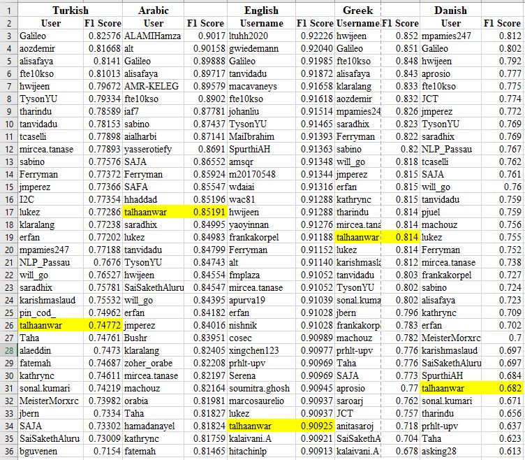

# OffenseEval2020
## OffenseEval2020 Competetion  
Usage of offensive language on social media is getting more common these days, and there is a need of a mechanism to detect it and control it. This paper deals with offensive language detection in five different languages; English, Arabic, Danish, Greek and Turkish. We presented an almost similar ensemble pipeline comprised of machine learning and deep learning models for all five languages. Three machine learning and four deep learning models were used in the ensemble. In the OffensEval-2020 competition our model achieved F1-score of 0.85, 0.74, 0.68, 0.81, and 0.9 for Arabic, Turkish, Danish, Greek and English language tasks respectively.
# Results

## Mean 5 fold cross validation result
<table>
<thead>
  <tr>
    <th>Technique</th>
    <th>Arabic</th>
    <th>Turkish</th>
    <th>Danish</th>
    <th>Greek</th>
    <th>English*</th>
  </tr>
</thead>
<tbody>
  <tr>
    <td>Count Vectorizer features</td>
    <td>0.80</td>
    <td>0.71</td>
    <td>0.75</td>
    <td>0.76</td>
    <td>0.67</td>
  </tr>
  <tr>
    <td>TF-IDF Word level features</td>
    <td>0.79</td>
    <td>0.69</td>
    <td>0.71</td>
    <td>0.75</td>
    <td>0.68</td>
  </tr>
  <tr>
    <td>TF-IDF Char level features</td>
    <td>0.85</td>
    <td>0.73</td>
    <td>0.76</td>
    <td>0.80</td>
    <td>0.69</td>
  </tr>
  <tr>
    <td>Bi LSTM followed by Bi GRU</td>
    <td>0.84</td>
    <td>0.72</td>
    <td>0.72</td>
    <td>0.78</td>
    <td>0.72</td>
  </tr>
  <tr>
    <td>Bi LSTM followed by Bi GRU with attention</td>
    <td>0.84</td>
    <td>0.71</td>
    <td>0.73</td>
    <td>0.77</td>
    <td>0.72</td>
  </tr>
  <tr>
    <td>Temporal Convolution Network</td>
    <td>0.84</td>
    <td>0.72</td>
    <td>0.62</td>
    <td>0.79</td>
    <td>0.71</td>
  </tr>
  <tr>
    <td>Convolution Neural Network</td>
    <td>0.80</td>
    <td>0.71</td>
    <td>0.58</td>
    <td>0.74</td>
    <td>0.72</td>
  </tr>
</tbody>
</table>


* in english [OLID dataset](https://github.com/talhaanwarch/Offensive-Language-Detection) is used
## Test Data result
<table>
<thead>
  <tr>
    <th>Language</th>
    <th>Arabic</th>
    <th>Turkish</th>
    <th>Danish</th>
    <th>Greek</th>
    <th>English</th>
  </tr>
</thead>
<tbody>
  <tr>
    <td>F1 Score</td>
    <td>0.85191</td>
    <td>0.74772</td>
    <td>0.682</td>
    <td>0.814</td>
    <td>0.90925</td>
  </tr>
</tbody>
</table>

# Position in competetion


# Citation  
Please cite following paper
```
@inproceedings{anwar2020tac,
  title={TAC at SemEval-2020 Task 12: Ensembling Approach for Multilingual Offensive Language Identification in Social Media},
  author={Anwar, Talha and Baig, Omer},
  booktitle={Proceedings of the Fourteenth Workshop on Semantic Evaluation},
  pages={2177--2182},
  year={2020}
}
```
